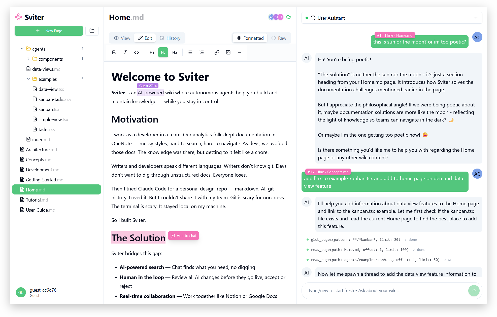

# 🌸 Sviter

AI-powered wiki where autonomous agents help you build and maintain knowledge.

**Status:** MVP — core features work, expect rough edges. See [roadmap](https://github.com/users/honix/projects/2).



## Features

- **AI Chat** — Ask questions, get answers from your wiki content
- **Autonomous Agents** — Request changes, AI works on a branch, you review and accept/reject
- **Git Under the Hood** — Full version control without the complexity
- **Real-time Collaboration** — Live updates, markdown editing
- **Pluggable LLM** — Claude SDK or OpenRouter - BYOK or connect to your local inference services
- **On-demand Custom Views for your data** — Ask AI to create an interactive view just with prompt

## Quick Start

Configure your `backend/.env` and `frontend/.env` files using `.env.example` as a reference.

```bash
make setup    # Install dependencies (first time)
make run      # Start backend (8000) and frontend (5173)
```

See  wiki-page for more information.

## How It Works

1. Chat with AI about your wiki
2. Ask it to make changes — spawns an agent on a new branch
3. Review the diff when done
4. Accept (merge) or Reject (discard)

## Use Cases

- **Spec-Driven Development** — Write specs in wiki, AI keeps docs and code in sync
- **Team Knowledge Base** — Devs ask questions, writers update docs, git stays hidden
- **Research & Notes** — Connect ideas across pages, AI helps cross-reference

## Documentation

See [Sviter-wiki](https://github.com/honix/Sviter-wiki/blob/main/pages/Home.md) for full documentation — built with Sviter and best viewed inside Sviter itself.

## License

FSL-1.1 (free for production use, no competing products for 2 years, then Apache 2.0)
